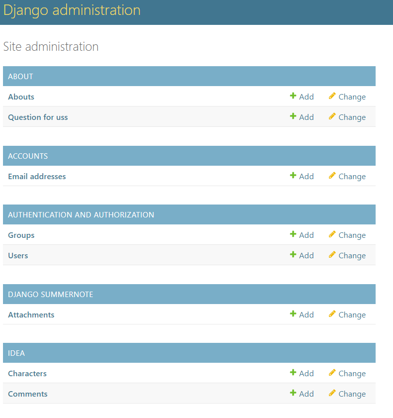

# Character Share

Character Share is a site that brings together people who enjoy playing roleplaying games such as D&D. Once a user is logged in, they are able to create their own character ideas and share them with others. Browsing through all the characters, users are able to leave comments and express their thougths about someone else's ideas. Character ideas and comments to those characters are automatically approved and are visible right away. If a comment or character idea is offensive or not uplifting, the system admin can log in and put characters and comments to 'approval is waiting'. This check is in place to ensure that the site stays a positive and uplifting place for all.

Visit the deployed site here: [Character Share](https://character-ideas-280e74d8cf8c.herokuapp.com/)

## CONTENTS

* [User Experience](#user-experience-ux)
  * [User Stories](#user-stories)
  * [Planning Process](#planning-process)
  * [Design](#design)
    * [Colour Scheme](#colour-scheme)
    * [Future Implementations](#future-implementations)
* [Features](#features)
* [Technologies](#technologies)
  * [Languages](#languages)
  * [Websites & Programs](#websites-programs)
* [Deployment](#deployment)
* [Testing](#testing)
   * [Validator Test](#validator-test)
   * [Manual Testing](#manual-testing)
* [Credits](#credits)
  * [Code Used](#code-used)
  * [Acknowledgments](#acknowledgments)

## User Experience (UX)

### User Stories

Site User
|  | |
|:-------:|:--------|
 | Register Account | As a User I can register an account so that I can create my character ideas |
 | Log in and out | As a User I can log in or out of my account so that others cannot use my profile |
 | View the main page | As a User I can view some character ideas so that I don't get overwhelmed |
 | View a single character idea | As a User I can click and view a single idea so that I can read more about it |
 | Send in a question to site admin | As a user I can send/submit a question so that question the site admin about something |
 | About the site | As a User I can go to the about page so that read more about the site and purpose |
 | Create character idea | As a User I can create my own character idea so that I can share it with others |
 | Edit my character | As a User I can edit/update my character so that if I have changed my mind I can |
 | Delete my Character Idea | As a User I can *delete my character Idea so that if I don't want it up any more, I can take it away |
 | Comment on a character | As a User I can make a commment on a character so that I can write my thoughts on it |
 | Edit a comment | As a User I can edit my comment so that if I made a mistake, I can change it |
 | Delete my comment | As a user I can delete my comment so that if I don't want it to be there any more, I can take it away |

Site Admin
|  | |
|:-------:|:--------|
 | Create idea | As a Admin I can create ideas so that show off my ideas and start the site |
 | Edit-delete-approve character Ideas | As a admin I can edit-delete and approve ideas so that site will function as intended |

#### Site User Goals

* Create and share character ideas
* Comment and connect with others about their characters and mine
* Bring together like minded people to share their ideas.

## Planning Process

I used Github to create a Agile work process that used User Stories with tasks. I added these to a project board where it was easy and clear to keep track of what still needed to be done. 

Planning out the layout of my site was done in [Balsamiq](https://balsamiq.com/).

<b>Github Board and Wireframes</b>

 

For the Models I created a ERD on paper but have transcribed it over to excel.
* Characters - holds information about user's character idea and is linked to the User Model which is built in.
* Comment - holds information about the comments a user can create. This is linked to Character and User models.
* About - holds information about the site, is not linked to another model.
* QuestionsForUs - holds form information about inquiries to the site admin, not linked to another model.

<b>Models ERD</b>

 

## Design

The base layout/design is used from the walkthrough project 'I Think Therefor I Blog' and Crispy Forms. I did customize most aspects of Character Share to better suit my wants for the site.

### Color Scheme

I chose a darker overall look with bright accents for my site. From black and shades of grey to white and then dark yellows to orange to red, a wide range but appealing to the eye.
* `Rgb(231, 46, 0)` Is for the Character Share title and other important text areas.
* `Rgb(218, 165, 32)` Is for Navlinks and some text areas.
* `Rgb(231, 104, 0)` Is for focused Navlinks and small text details.
* `Rgb(32, 37, 37)` Is used for general background color and for buttons.
* `Rgb(0, 0, 0)` Is for on hover of buttons, a darker version of the above.
* `Rgb(206, 206, 206)` Is the background color of buttons.
* `rgb(255, 255, 255)` Is for on hover of buttons, a brighter version of the above
* 

  

### Future Implementations

1. Creating a Favorites button, to save your favorite character ideas.
2. User Profile Page which will display account info, favorite characters, number of favorites,
    your comments and your characters.
3. Search bar for users to look up characters via key words
4. Add automated testing
5. Creating a Admin html page so the admin panel does not need to be used.

## Features

Features of Character Share!

### Navigation
The navigation bar is simple yet elegant. The site title is displayed first with coloring to draw attention to it. The navigation links are a different color and the active site is even lighter yet. On mobile devices, the navigation links are collapse into a menu bar, but still shows the title.

<b>Navbar different devices</b>

 

If not logged into Character Share you see the following links and a message informing you that you are not logged in:
* Home
* About
* Register
* Login

<b>Not logged in</b>

 

If logged into Character Share you see the following links and a message informing you that you are logged in:
* Home
* About
* Logout
* Create Character
* My Characters

<b>Logged in</b>

 

### Home
The main Home page is where all the character ideas created by everyone is. It is paginated to display 6 characters per page with a Next and/or Previous button at the bottom.
Clicking the imager or Title of a character will take the user to the Character Detail page.

<b>Home page</b>

 

### Character Details
On this page a Character can be examined closer. It shows all parts of the Character Model and users are able to comment on the character design below it.
Once logged in a user can leave a comment, edit their own comments or delete their own comments( will be asked confirmation)

<b>Character Details page</b>

 

### About

In the about section, a user can read why the site is there and what is expected of users. Below it is a contact form to get in touch with site admins.

<b>About</b>

 

### Register
A user can register to Character Share if they have not already done so.

<b>Register</b>

 

### Sign in
A user can sign in to Character Share if they have an account.

<b>Sign In</b>

 

### Log Out
A user can sign out of their account if they are signed in.

<b>Sign Out</b>

 

### Create Character
A user can create their character idea if they are signed in. Fill in the required fields and attach a photo if you like (there is a default picture otherwise).

<b>Create Character</b>

 

### My Characters
Similar to the Home page, but with only characters belonging to the logged in User, this page displays character ideas (paginated by 6 again).
Here is where the User can also Edit or Delete one of their characters. Clicking Edit will retreive all the character info and prefill the form for you.
Clicking Delete, will pop up a modal asking for confirmation.

<b>My Characters page</b>

 

### Admin Panel
A superuser can log into the admin panel by going to the main page and appending a /admin and then logging in.
Here the admin can edit, delete, and approve all comments and characters. Change and update the about page and see which users have accounts.

<b>Admin Panel</b>

 

## Technologies 

### Languages 

* Python -Provides the functionality for the Character Share.
* HTML5 - Provides the content and structure for the Character Share.
* CSS - Provides the styling for the Character Share.
* JavaScript - Provides interactive elements of the Character Share.

###  Websites & Programs 
* [Bootstrap](https://getbootstrap.com/) - Build fas, responsive sites with this frontend toolkit.
* [Django](https://www.djangoproject.com/) - Framework for building apps quickly and with less code.
* [Balsamiq](https://balsamiq.com/) - For wireframes.
* [Chatgpt](https://chat.openai.com/) - Used to help identify problems in code and possible way to solve them.
* [Github](https://github.com/) - Created repository and stored files here after commits. Users Stories and project board.
* [Heroku](https://heroku.com/) - For deploying Character Share.
* [Microsoft Visual Studio](https://visualstudio.microsoft.com/) - Wrote code and did commits to Github from here.
* [W3 School](https://www.w3schools.com/) Read and used as a guide for some code.

## Deployment 

Character share is deployed from Heroku - [Character Share](https://character-ideas-280e74d8cf8c.herokuapp.com/).

To Deploy the site from Heroku Pages:

1. Create a GitHub repository from the Code Institute template.
2. Open repository in VScode (or your choice of program).
3. Open terminal and install Django and supporting libraries that are required:
   * pip3 install 'django<4' gunicorn
   * pip3 install 'dj_database_url psycopg2
   * pip3 install 'dj3-cloudinary-storage
4. Create the requirements file in command terminal: 
   * pip3 freeze --local > requirements.txt  
 This will create and add required libraries to requirements.tx
5. Create project in command terminal:
    * jango-admin startproject YOUR_PROJECT_NAME . 
6. Create the first app from command terminal:
    * python3 manage.py startapp APP_NAME
7. Added the created app to the settings.py under INSTALLED_APPS.
8. Migrate the changes from the terminal:
    * python3 manage.py migrate
9. Log in or create account in Heroku and then log in.
10. Once logged in, in the upper right hand side of the screen, click 'New' and then 'Create new app'.
Choose a name that is not taken, in this case Character Share, and click 'Create app'. Connect this to your Github.
11. To add a database to the app you need to go to the resources tab ->> add-ons, search for 'Heroku Postgres' and add it.
12. Go to the settings tab and click on the reveal Config Vars button. Copy the text from DATABASE_URL and create a Config Var withe the url for your database.
13. Go back to VSCode and create a new env.py in the top level directory. Then add these rows:
    * import os - This imports the os library
    * os.environ["DATABASE_URL_FROM HEROKU"] - This sets the environment variables.
    * os.environ["SECRET_KEY"] - Here you can choose whatever secret key you want.
14. Add Secret key to config vars in Heroku.
15. In VScode, go to setting.py and add the following at the top:
    * import os
    * import dj_database_url
    * if os.path.isfile("env.py"):
    * import env
16. In the settings file, remove the insecure secret key and replace it with: SECRET_KEY = os.environ.get('SECRET_KEY')
17. Add the link to DATABASE_URL in setting.py to correctly link your database.
18. Save all your fields and migrate the changes from the command line.
19. Connect Cloudinary for image storage solution. First you need to create a Cloudinary account and from the Cloudinary dashboard copy the API Environment Variable.
20. Go back to the env.py file and add the Cloudinary url (it's very important that the url is correct):
    * os.environ["CLOUDINARY_URL"] = "cloudinary://************************"
21. Add cloudinary url in the Config Vars in Heroku.
22. Add a DISABLE_COLLECTSTATIC and key '1' to config vars.
23. We need to fix the Heroku templates directory to work for us. Change the templates directory in settings.py to TEMPLATES_DIR in the teamplates array.
24. Add Heroku in settings.py to ALLOWED_HOSTS.
25. Create a Procfile file in the top directory of project and add the line 'web: gunicorn characterideas.wsgi'
26. Save, commit and push all changes to Github, which will read over to Heroku.
27. Click Deploy and then down to manual deploy to Deploy the site via Heroku.

#### How to Fork in Github

If you want to fork this repository in Github:

1. Go to the repository for this project [Character Share](https://github.com/reltoom/Character-Ideas).
2. In the upper right hand area of the screen, click the 'Fork' button.
3. Then when the menu drops down, click 'Create New Fork'. (If you are the owner of a repository, you cannot fork.) 

#### How to Clone in Github

If you want to clone this repository:

1. Go to the repository for this project [Character Share](https://github.com/reltoom/Character-Ideas).
3. Click on the green 'Code' button and then select how you would like to clone: HTTPS, SSH or GitHub CLI (under the 'local' tab). 
4. Either copy the desired code or click to open with another program from the list below the code.
4. Open your code editor and go to 'Clone Repository' usually under 'File'.
5. Paste if your code and then 'Clone'.

## Testing

Character Share has been tested on: Chrome, Microsoft Edge and Safari and works equally well on each.

### Maunual Testing
| | |
|:-------:|:--------|
| Paginated Home page | Clicking on the Next or Previous button works as intended, taking me to the next page. |
| Character picture | Clicking on the character picture takes me to the character details page. |
| Character title | Clicking on the character title takes me to the character details page. |
| Navbar links | Clicking on each of the navbar links when not logged, takes me to the correct corresponding page. |
| Navbar links | Clicking on each of the navbar links when logged in, takes me to the correct corresponding page. |
| Navbar mobile | Navbar is collapsable and links work as intended. |
| About form Name | Name field must be filled in before being able to send form. |
| About form Email | Email field must be filled in with an email (@) before being able to send form. |
| About form Message | Message field must be filled in before being able to send form. |
| About form submit button | Submit button works and notifies user when the form has been sent. |
| Register form | Username and password must be filled in before being able to register. Email is optional. |
| Register form button | Sign up button works when the form is filled out properly and creates a new account. |
| Login form | Username and password need to match what was created at Register |
| Login form button | Sign in button logs user in if correct combination is used. |
| Logout button | Clicking the logout button will correctly log the user out of their account. |
| | |
| Create character form | Form is filled with the correct fields from the Character Model. |
| Create-title | Title must be unique and cannot be blank. |
| Create-race | Human is the default but a user can use the drop down to select a different race. |
| Create-Gender | No gender is the default but a user can use the drop down to select which they like. |
| Create-class-archetype | Fighter is the default class but can be changed with the dropdown choices. |
| Create-weapons | Can be blank and user can write what they want in it. |
| Create-armor | Can be blank and user can write what they want in it. |
| Create-picture | If user does not upload an image, a default is provided |
| Create-description | Cannot be blank but has no minimum limit to what you can write. |
| Create-excerpt | Can be blank and user can write what they want in it. |
| Create-button | Filling in the required forms creates a new character when button is clicked. |
| My characters | Only displays characters created but the logged in user. |
| My char buttons | Both the edit and delete buttons appera in the my characters view. |
| Delete character | Clicking the Delete button will pop up a message asking for confirmation of deletion. |
| Confirm delete | Canceling deleting character works, as well as confirming you want to delete character. Message shows informing user of successful deletion. |
| Edit character | Correctly retrieves all current character information and prefills form for you. Title does not need to be changed as you are editing a character. |
| Posting comment | Once logged in, going to the character detail view, a user can leave a comment. |
| Edit comment | A user who has left a comment can edit the comment, it correctly fills in the comment 'body' with the message you want to edit. |
| Delete comment | A user who has left a comment can delete their comments. Confirmation is required and works correctly.|
| Comment count | Comment counter right underneath the picture, above the leave a comment, counts comments correctly. |

## Validator Test

[Pep8 Python Validator](https://pep8ci.herokuapp.com/) is used to validate Character Share python code.

There are no errors shown for code in Character Share!

[W3C](https://validator.w3.org/) is used to validate the HTML for Character Share, there are no errors. 1 warning about article lacking heading on the About page.

[JShint](https://jshint.com/) is used to validate the Javascript for Character Share. No errors.

## Credits

### Code Used

Using the tutorial videos from Code Institute and some help from Chatgpt, I was able to figure out and construct the code for Character Share. There was alot of trial error and some hindsight for future developments.
 

Structure for the README file is from my project [Ways to Relax](https://github.com/reltoom/Project-1-Relax) adjusted to fit Character Share.
Some content for the README is taken from [Worldofmarcus](https://github.com/worldofmarcus/project-portfolio-4/blob/main/README.md#features-left-to-implement).

### Acknowledgments

Thank you to my daughter and wife for helping support me through my studies.

Thank you to the Swedish Slack channel for keeping my spirits high.

Thank you to my friends on the great feeback to my project.